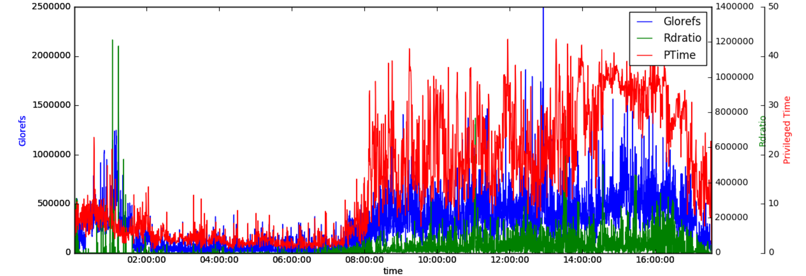

Visualizing the data jungle -- Part II. More sources!

In [last week's](https://community.intersystems.com/post/visualizing-data-jungle-part-i-lets-make-graph) discussion we created a simple graph based on the data input from one file. Now as we all know sometimes we have multiple different datafiles to parse and correlate. So this week we are going to load additional perfmon data and learn how to plot that into the same graph. 
Since we're might want to use our generated graphs in reports or on a webpage, we'll also look into ways to export the generated graphs.

# Loading windows perfmon data

The perfmon data extracted from standard pbuttons report is a bit of a peculiar data format. On first glance it is a pretty straightforward csv file. The first row contains the column headers, subsequent rows the datapoints.
However, for our porposes we will have to do something about the quotes surrounding the value entries. Using the standard approach to parse the file into python we will end up with columns of string objects, which don't work well to graph them. 

```python
perfmonfile="../vis-part2/perfmon.txt"
perfmon=pd.read_csv(perfmonfile,
                    header=0,
                    index_col=0,
                    converters={0: parse_datetime
                    })
```

Unlike the in the mgstat file we used in the first part, the header names are in the first row. We want the first column to define our index (this way we don't need to re-index the dataframe as we did last time). Finally we have to parse the first column to actually represent a DateTime. Otherwise we'd end up with a string index. To do that, we define a little helper function to parse the perfmon dates:

```python
def parse_datetime(x):
    dt = datetime.strptime(x, '%m/%d/%Y %H:%M:%S.%f')
        
    return dt
```

The ```converters``` parameter lets us pass it in as handler for the first column. 

After running this, we end up with the perfmon data in a DataFrame:
```python
<class 'pandas.core.frame.DataFrame'>
Index: 2104 entries, 01/03/2017 00:01:19.781 to 01/03/2017 17:32:51.957
Columns: 105 entries, \\WEBSERVER\Memory\Available MBytes to \\WEBSERVER\System\Processor Queue Length
dtypes: float64(1), int64(11), object(93)
memory usage: 1.7+ MB
```

Note that the majority of columns is currently an *object*. To convert these columns to a usable format, we'll employ the [to_numeric](http://pandas.pydata.org/pandas-docs/version/0.19.2/generated/pandas.to_numeric.html) function. While we could use [apply](http://pandas.pydata.org/pandas-docs/stable/generated/pandas.DataFrame.apply.html) to call it on every column, that would mess up our index again. So we'll just plot the data directly while piping it through that. 


# Plotting 
For this run we're interested in plotting the total privileged time of all CPUs. Unfortunately the column numbers are not constant and vary with the number of CPUs and drives. So you'll just have to look through and figure out which column it is. In m y example it's 91:

```python
perfmon.columns[91]

'\\\\WEBSERVER\\Processor(_Total)\\% Privileged Time'
```

We'll pretty much just use the same approach as last time to create a graph with Glorefs,Rdratio, and our new Privileged Time:

```python
plt.figure(num=None, figsize=(16,5), dpi=80, facecolor='w', edgecolor='k')
host = host_subplot(111, axes_class=AA.Axes)
plt.subplots_adjust(right=0.75)

par1 = host.twinx()
par2 = host.twinx()
offset = 60
new_fixed_axis = par2.get_grid_helper().new_fixed_axis
par2.axis["right"] = new_fixed_axis(loc="right",axes=par2,offset=(offset, 0))
par2.axis["right"].toggle(all=True)

host.set_xlabel("time")
host.set_ylabel("Glorefs")

par1.set_ylabel("Rdratio")
par2.set_ylabel("Privileged Time")
ws=30
p1,=host.plot(data.Glorefs,label="Glorefs")
p2,=par1.plot(data.Rdratio,label="Rdratio")
p3,=par2.plot(pd.to_numeric(perfmon[perfmon.columns[91]],errors='coerce'),label="PTime")

host.legend()

host.axis["left"].label.set_color(p1.get_color())
par1.axis["right"].label.set_color(p2.get_color())
par2.axis["right"].label.set_color(p3.get_color())

plt.draw()
plt.show()
```

This is where you get to use *to_numeric*:
```python
p3,=par2.plot(pd.to_numeric(perfmon[perfmon.columns[91]],errors='coerce'),label="PTime")
```



# Redirecting the output
While the notebook is really nice for getting a quick glance of our data,eventually we'd like to be able to run our scripts non-interactively, so we want to output our graphs as images. 
Screenshotting is obviously involving too much manual work, so we'll use the pyplot function *savefig()*.

We'll replace the *draw()* and *show()* calls with the *savefig()* call:

```python
#plt.draw()
#plt.show()
plt.savefig("ptime-out.png")
```

which will give us the png in our current working directory.

# Advanced output

As a little extra exercise we'll have a look at [Bokeh](http://bokeh.pydata.org/en/latest/). One of the manu nice features bokeh is adding to our toolbox, is the ability to output our graphs as an interactive html file. Interactive in this case means, we can scroll and zoom in our data. Add the ability to link graphs together and you can easily create interactive renderings of pbuttons data (or other). These are especially nice, because they run in any modern  browser and can easily distributed to multiple people.

